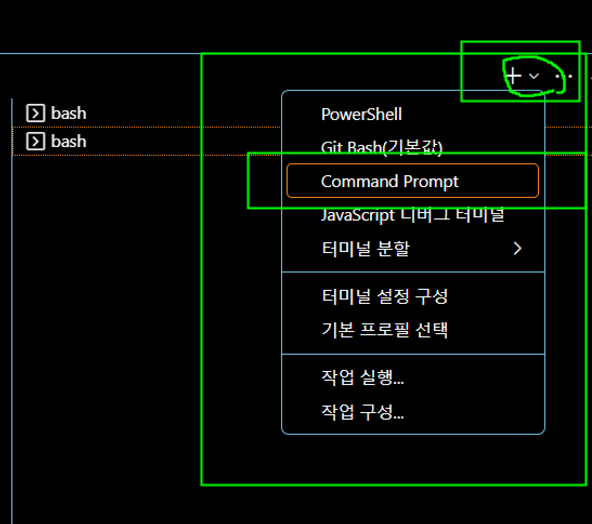
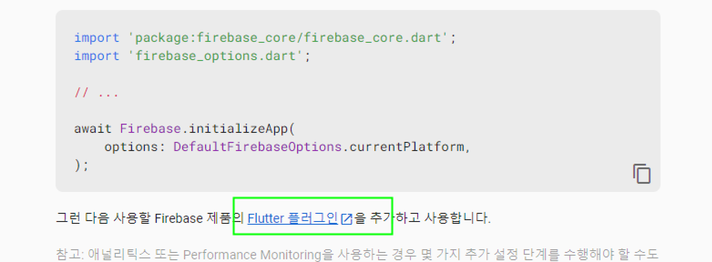

# Flutter firebase 연동 프로젝트

- `auth(인증)`, `fireStore(DBMS)`, `real Database(DBMS)` 등을 연동하여 프로젝트를 구현할수 있다.
- 다른 프로젝트(react)에서는 Hostring 등도 사용할 수 있다.

## firebase-auth

- `firebase`를 통하여 `Email 방식의 회원가입`, `Email 방식의 로그인`을 구현할수 있다
- `google login` 등 `oAuth2(인증 Token 방식)` 방식의 인증을 구현할수 있다.

## DBMS 연동 : fireStore, real Database

- `NoSQL` 방식으로 Data CRUD 를 구현할 수 있고,
- `1:1` 방식의 채팅 구현
- `Messagage` 전달 등도 구현

## Flutter 와 firebase 를 연동하기 위하여 사전 도구 설치


- Cli 도구 설치 : `npm install -g firebase-tools@latest`
- 설치 확인 : `firebase --version`

## firebase 프로젝트 생성하기

- `firbase.google.com` 사이트에서 새로운 프로젝트 생성하기

- 생성된 프로젝트에 앱 추가하기 : `flutter 앱 추가`
  
  

- `firebase-cli` 명령을 실행하여 프로젝트 구성하기
  

- vscode 에서 윈도우 cmd 창열기 : `flutterfire` 명령은 윈도우 cmd 창에서만 실행되기 때문에 cmd 창을 열고 실행해야 한다  
    
  

- 새로 생성한 프로젝트로 폴더 이동 하기 : `cd flutter-008-firbase`  
  

- 프로젝트 폴더에서 config 명령 실행 : `flutterfire configure --project=flutter-my-app-73f61`

- 명령 실행후 경고가 나오면 시스템 path 에 경로 등록한다
  
  `C:\Users\callor\AppData\Local\Pub\Cache\bin` 폴더를 path 에 경로 등록한다.

- cmd 창에서 명령 `flutterfire configure --project=flutter-my-app-73f61` 실행한후 적용할 대상 선택
  

  ## 프로젝트에 dependecy 설정하기

- console 화면에서 firebase plugin 설정으로 진행하기
  

- 화면 상단에서 android 선택하고 절차대로 진행  
  

```bash
firebase login
flutter pub add firebase_core
flutter pub add firebase_auth
```

- dependency 를 정상적으로 설치했는데, app 실행에 문제가 발생하는 경우가 가끔있다. dependency 들의 version 이 서로 맞지 않아서 발생하는 경우가 있다 이때는 다음 명령으로 clean 을 실행한다

```bash
flutter pub upgrade outdated package
flutter clean
flutter pub get
```

## 배포시 Dex 오류 발생하는 경우

- `project / android / app / build.gradle` 파일을 찾는다
- 파일에서 `defaultConfig` 항목을 찾는다. `multiDexEnabled true` 추가

```kt
defaultConfig {
  versionName flutterVersionName
  multiDexEnabled true
}
```
